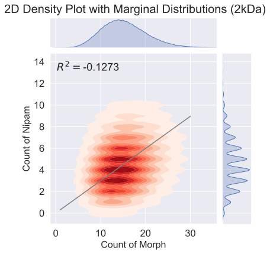
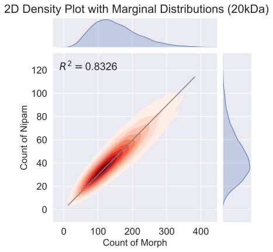

# Compositional-Drift-with-Compositional-Dispersity-Index

This program allows polymer chemists to simulate the results of controlled polymerizations given all required reaction parameters (monomer amounts, monomer reactivity ratio, average polydispersity, ect.). The simulations use the Mayo-Lewis equation along with Monte Carlo methods to predict polymer chain growth. The tool allows for rapid pre-experimental screening of reaction conditions along with critical post-synthesis analysis of the chain structure. Additional features in this version of Compositional Drift include scripts for visualizing (in 2D plots) the heterogeneity of compositions in the polymer chains of a given reaction as well as an example method for calculating compositional dispersity index.

## Contributors:

Anton A. A. Auzten

Alexander Prossnitz

Samantha Tetef

Simulations from [github.com/vince-wu/CompositionalDrift](https://github.com/vince-wu/CompositionalDrift)

## Examples

Using the `2Dplot.ipynb` Jupyter notebook, we read in the results from the Compositional Drift simulations (found in the `Data\` folder) and made the following plots (with 2kDa and 20kDa molecular weight, respectively).

